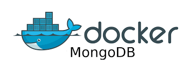

<h1><strong>Procedimiento para crear un entorno de MongoDB en Docker</strong></h1>

    

<h2>Introducción</h2>

MongoDB en Docker: La combinación perfecta para una experiencia de desarrollo sin complicaciones.

¿Cansado de instalaciones complejas y configuraciones tediosas? Con MongoDB en Docker, ¡olvídate de esos problemas! Experimenta una forma más sencilla y eficiente de ejecutar tu base de datos favorita.

Docker te ofrece:

<ul>
<li>Entorno aislado: Cada contenedor MongoDB se ejecuta en su propio espacio, sin afectar a otros programas o     configuraciones.</li>
<li>Portabilidad: Mueve tu base de datos entre diferentes máquinas sin problemas de compatibilidad.</li>
<li>Escalabilidad: Aumenta o reduce la capacidad de tu base de datos de forma rápida y flexible.</li>
<li>Facilidad de uso: Inicia y detén tu base de datos con un solo comando.</li>
</li>Reproducibilidad: Comparte tus configuraciones y entornos con otros desarrolladores de forma precisa.</li>
</ul>

<h2>Los Pasos a continuacion fueron realizado y probado en Debian (Codename:bullseye)</h2>

Paso 1. Creamos un directorio 
[dockeruser@debian ~]$ mkdir mongodb-docker

Paso 2. Creamos un archivo de configuración YAML
[dockeruser@debian ~]$ touch docker-compose.yml

Paso 3. Abrimos el archivo en modo "append" (Insertar) 
[dockeruser@debian ~]$ cat > docker-compose.yml

Paso 4. Copiar el codigo que sigue en el archivo docker-compose.yml

version: '2.2'

services:

  mongo:
    image: mongo:4.0.4
    restart: always
    container_name: monguito
    environment:
      - MONGODB_USER="user"
      - MONGODB_PASS="pass"	
    volumes:
      - ./monguitodata:/data/db
      - ./monguitodata/log:/var/log/mongodb/
    ports:
      - "27017:27017"

Nota: Para guardar el contendio ingrese una linea con [ENTER] y luego control D para cerrar.

Paso 5. Creamos un archivo shell script para ejecutar un conjunto de comandos

[dockeruser@debian ~]$ touch mongodb.sh

Paso 5.1. Crear directorio para volumen de mongo

[dockeruser@debian ~]$ mkdir monguitodata && cd monguitodata; cd monguitodata || mkdir log

Paso 5.2. Salimos del directorio

[dockeruser@debian ~]$ cd

Paso 5.3. Iniciamos el contendor

[dockeruser@debian ~]$ sudo docker-compose up -d

Paso 5.4. Mostrar mensaje

[dockeruser@debian ~]$  echo "Monguito está iniciandose ......."

Paso 5.5. Entramos al contenedor

[dockeruser@debian ~]$ sudo docker exec -it monguito bash

> Control + d
_________________________________________________________
Paso 6. Asignar permisos de ejecución y ejecutar mongo.sh
> chmod u+x mongo.sh
> ./mongo.sh 
_______
Paso 7. 

CREANDO UN CONTENEDOR

Instalar Mongo: 
En la línea de comando.
____________________________________________________________
Paso 1. Crear documento de docker-compose.

Opción 1.

> Usar docker compose, visual estudio code, instalando la extensión de docker.

Opción 2.

> touch docker-compose.yml
> cat > docker-compose.yml
_____________________________________________
Paso 2. Crear documento de docker-compose.yml:

version: '2.2'

services:

  mongo:
    image: mongo:4.0.4
    restart: always
    container_name: monguito
    environment:
      - MONGODB_USER="user"
      - MONGODB_PASS="pass"	
      
    volumes:
      - ./monguitodata:/data/db
      - ./monguitodata/log:/var/log/mongodb/
    ports:
      - "27017:27017"
    
____________________________________________________________
paso 3. Crear archivos para correr comando en la la terminal:

> touch mongo.sh
__________________________________________
Paso 4. Cargar comandos al archivo creado:

> cat > mongo.sh   	(Copiar y pegar los comandos que queremos se ejecuten automáticos)

#Crear carpeta para volumen de mongo:
mkdir monguitodata && cd monguitodata; cd monguitodata || mkdir log

cd

#Iniciar el contenedor:
sudo docker-compose up -d

#Mostrar mensaje:
echo "Monguito está iniciandose ......."

#entrar en el contenedor
sudo docker exec -it monguito bash

_______
Paso 5.

> Control + d
_________________________________________________________
Paso 6. Asignar permisos de ejecución y ejecutar mongo.sh
> chmod u+x mongo.sh
> ./mongo.sh 
_______
Paso 7. 

USAR MONGO A PLACER.

<h2><strong>Conceptualizando</strong></h2>
<!-- Seccion de conceptos -->

  <ul>
    <li>
<strong>Docker</strong>: es como una caja que encierra una aplicación con todo lo que necesita para funcionar (código, librerías). La puedes mover fácilmente a distintas máquinas sin preocuparte por compatibilidad. Imagina Legos® para software: independientes, portables y apilables.
</li>
    <li>
<strong>MongoDB</strong>: es una base de datos NoSQL de código abierto. Almacena datos en documentos flexibles, como JSON, en lugar de tablas rígidas. Es fácil de usar, ideal para aplicaciones web y móviles, y escalable para grandes conjuntos de datos.
</li>
    <li>
<strong>Docker</strong>
</li>
  </ul>

